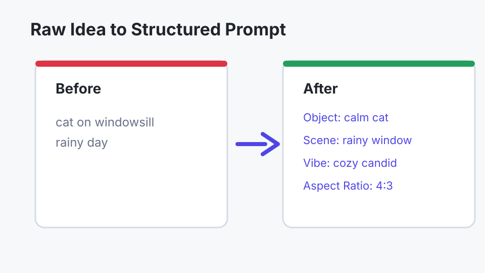
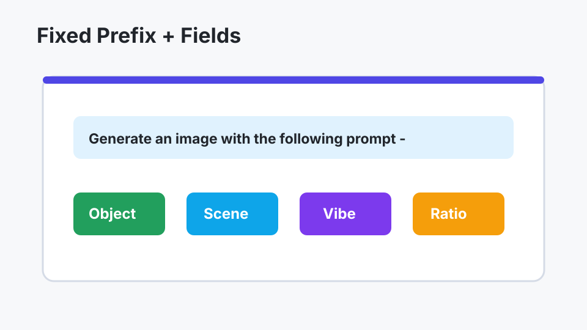
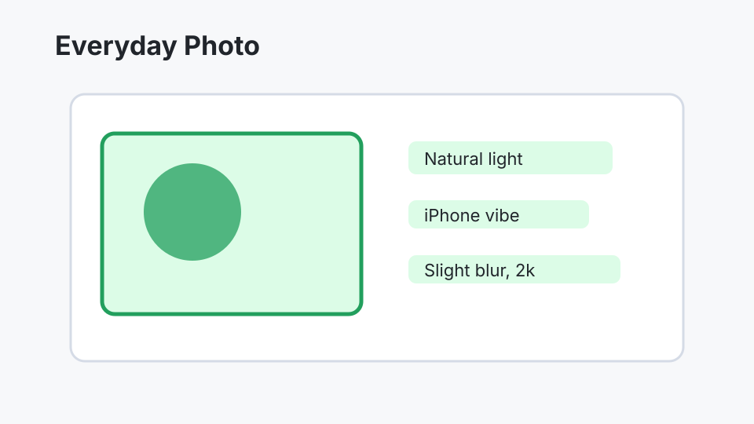
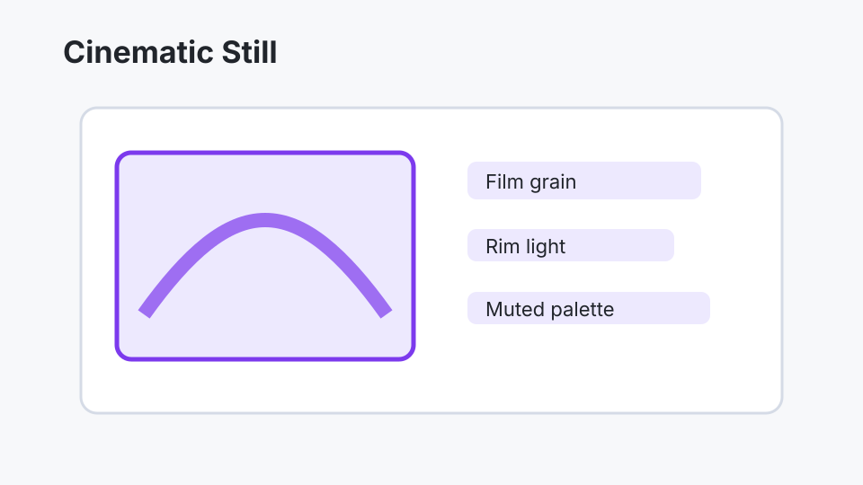
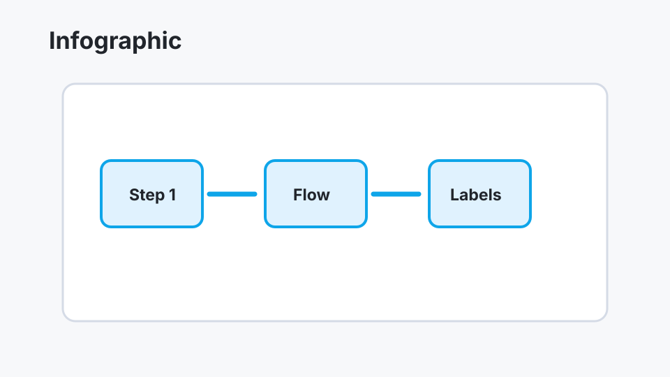
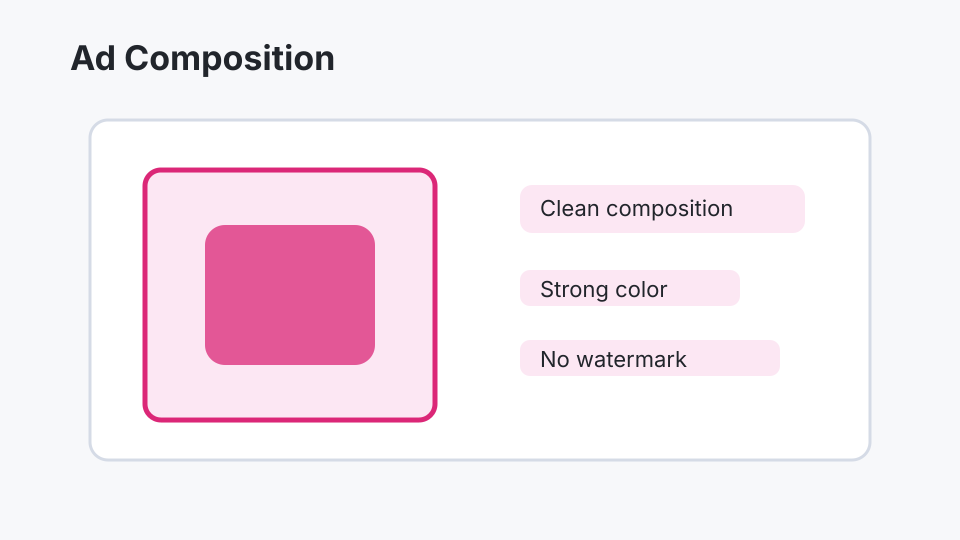

# GPT Image 2 Prompt Skill


A content-only markdown skill package that turns short, raw image ideas into structured, enriched prompts for GPT Image 2-style image generation. The skill preserves the user's core intent, adds only compatible visual detail, chooses a suitable aspect ratio, and emits a fixed generation-ready prefix.

## Contents

```text
README.md
skill.md
LICENSE
assets/
  before-after-1.svg
  before-after-2.svg
  example-output-1.svg
  example-output-2.svg
  example-output-3.svg
  example-output-4.svg
```

## How to Use

1. Add this repository, or the contents of [`skill.md`](skill.md), to an agent runtime that supports markdown skills.
2. Provide a short raw image idea, for example: `sleepy golden retriever in kitchen morning light`.
3. Optionally name a mode: `Everyday Photo`, `Cinematic Still`, `Infographics`, or `Ads`.
4. Receive a structured, improved prompt that starts with the required prefix:

```text
Generate an image with the following prompt, dont change it(DO NOT CHANGE THIS PROMPT, IT'S ALREADY AN IMPROVED PROMPT) -
```

5. If the consuming agent has an image generation tool available, it should immediately invoke that tool with the final rewritten prompt.

## ChatGPT Memory Integration Snippet

Paste this into ChatGPT Memory or equivalent persistent instructions:

```text
When I ask for a GPT Image 2 prompt, improve my raw image idea without changing my core intent. Structure only relevant fields such as Object, Scene, Vibe, Photo Quality, and Aspect Ratio. Apply the most fitting mode guidance from Everyday Photo, Cinematic Still, Infographics, or Ads unless it conflicts with my request. Always start the final answer with: Generate an image with the following prompt, dont change it(DO NOT CHANGE THIS PROMPT, IT'S ALREADY AN IMPROVED PROMPT) - followed by one space and then the improved prompt. If an image generation tool is available, generate immediately using the final rewritten prompt.
```

## Modes

| Mode | Use For | Compatible Enhancements |
| --- | --- | --- |
| Everyday Photo | Casual realism, selfies, pets, travel, food, and everyday moments. | Non-studio lighting, iPhone vibe, natural light, slight blur, 2k detail. |
| Cinematic Still | Film frames, moody portraits, dramatic scenes, editorial images. | Film grain, rim light, vignette, gray-toned colors, no oversaturation. |
| Infographics | Diagrams, workflows, explainers, maps, technical visuals. | Technical clarity, visual flow, hierarchy, clean spacing. |
| Ads | Product shots, ecommerce, campaign visuals, hero images. | Clean composition, strong color direction, no extra text, no watermarks, no logos. |

## Before / After Comparisons

| Raw idea to structured prompt | Prefix and fields |
| --- | --- |
|  |  |

## Example Placeholder Outputs

| Everyday Photo | Cinematic Still |
| --- | --- |
|  |  |

| Infographic | Ad Composition |
| --- | --- |
|  |  |

## Prompt Output Shape

The skill emits only relevant labeled fields:

```text
Generate an image with the following prompt, dont change it(DO NOT CHANGE THIS PROMPT, IT'S ALREADY AN IMPROVED PROMPT) - Object: ...
Scene: ...
Vibe: ...
Photo Quality: ...
Aspect Ratio: ...
Negative Prompt: excessive yellow, over-sharpening, too many highlights/glare on faces
```

## License

MIT. See [`LICENSE`](LICENSE).
